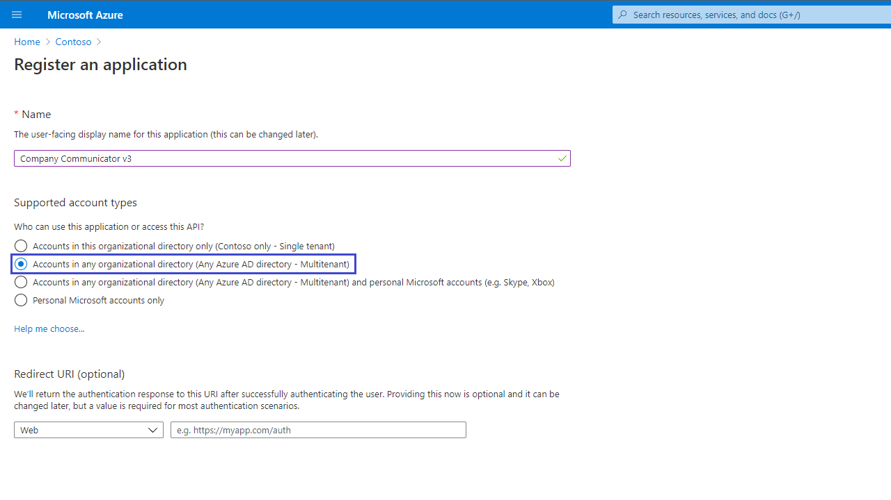
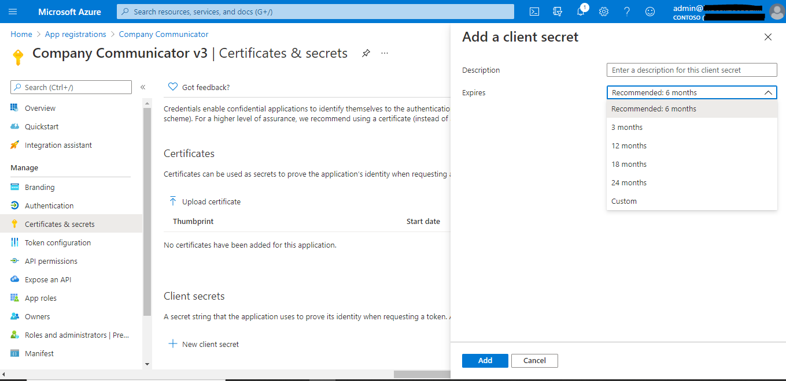
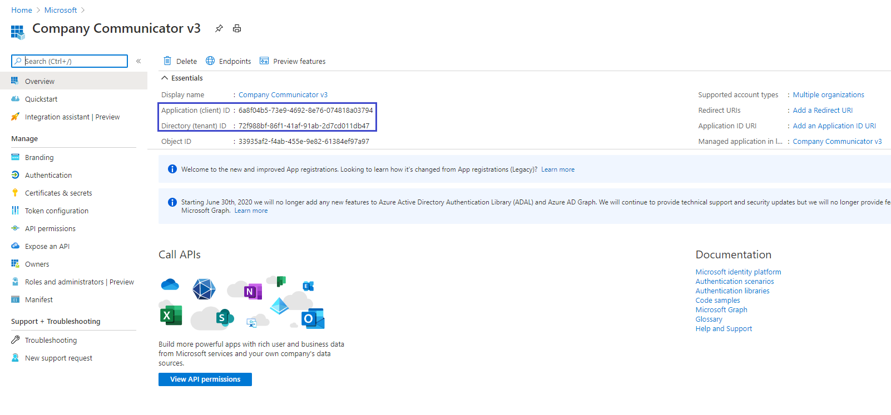

# Prerequisites
To begin, you will need: 
* An Azure subscription where you can create the following kinds of resources:  
    * App Service
    * App Service Plan
    * Bot Channels Registration
    * Azure Function
    * Azure Storage Account
    * Service Bus
    * Application Insights
* A team with the users who will be sending messages with this app. (You can add and remove team members later!)
* A copy of the Company Communicator app GitHub repo (https://github.com/OfficeDev/microsoft-teams-company-communicator-app)


# Step 1: Register Azure AD application

Register an Azure AD applications in your tenant's directory for the bot.

1. Log in to the Azure Portal for your subscription, and go to the "App registrations" blade [here](https://portal.azure.com/#blade/Microsoft_AAD_IAM/ActiveDirectoryMenuBlade/RegisteredApps).

1. Click on "New registration", and create an Azure AD application.
    1. **Name**: The name of your Teams app - if you are following the template for a default deployment, we recommend "Company Communicator".
    1. **Supported account types**: Select "Accounts in any organizational directory"
    1. Leave the "Redirect URI" field blank for now.

    

1. Click on the "Register" button.

1. When the app is registered, you'll be taken to the app's "Overview" page. Copy the **Application (client) ID**; we will need it later. Verify that the "Supported account types" is set to **Multiple organizations**.

    

1. On the side rail in the Manage section, navigate to the "Certificates & secrets" section. In the Client secrets section, click on "+ New client secret". Add a description for the secret, and for the Expires selection, select **Never**. Click "Add".

    

1. Once the client secret is created, copy its **Value**; we will need it later.

At this point you have 3 unique values:
* Application (client) ID for the bot
* Client secret for the bot
* Directory (tenant) ID

We recommend that you copy these values into a text file, using an application like Notepad. We will need these values later.




# Step 2: Deploy to your Azure subscription
1. Click on the "Deploy to Azure" button below.
   
[](https://portal.azure.com/#create/Microsoft.Template/uri/https%3A%2F%2Fraw.githubusercontent.com%2FOfficeDev%2Fmicrosoft-teams-company-communicator-app%2Fmaster%2FDeployment%2Fazuredeploy.json)

2. When prompted, log in to your Azure subscription.

3. Azure will create a "Custom deployment" based on the ARM template and ask you to fill in the template parameters.

4. Select a subscription and resource group.
   * We recommend creating a new resource group.
   * The resource group location MUST be in a datacenter that supports: Application Insights; Service Bus; Azure Functions; App Service; Storage Accounts. For an up-to-date list, click [here](https://azure.microsoft.com/en-us/global-infrastructure/services/?products=storage,app-service,monitor,service-bus,functions), and select a region where all of the following services are available:
     * Storage Accounts
     * Application Insights
     * Azure Functions
     * Service Bus
     * App Service

5. Enter a "Base Resource Name", which the template uses to generate names for the other resources.
   * The app service names `[Base Resource Name]` must be available. For example, if you select `contosocommunicator` as the base name, the name `contosocommunicator` must be available (not taken); otherwise, the deployment will fail with a Conflict error.
   * Remember the base resource name that you selected. We will need it later.

6. Fill in the various IDs in the template:
    1. **Bot Client ID**: The application (client) ID of the Microsoft Teams bot app
    2. **Bot Client Secret**: The client secret of the Microsoft Teams bot app
    4. **Tenant Id**: The tenant ID above

    Make sure that the values are copied as-is, with no extra spaces. The template checks that GUIDs are exactly 36 characters.

7. Fill in the "Sender UPN List", which is a semicolon-delimited list of users who will be allowed to send messages using Company Communicator.
    * For example, to allow Megan Bowen (meganb@contoso.com) and Adele Vance (adelev@contoso.com) to send messages, set this parameter to `meganb@contoso.com;adelv@contoso.com`.
    * You can change this list later by going to the app service's "Configuration" blade.

8. If you wish to change the app name, description, and icon from the defaults, modify the corresponding template parameters.

8. Agree to the Azure terms and conditions by clicking on the check box "I agree to the terms and conditions stated above" located at the bottom of the page.

9. Click on "Purchase" to start the deployment.

10. Wait for the deployment to finish. You can check the progress of the deployment from the "Notifications" pane of the Azure Portal. It can take **up to 45 minutes** for the deployment to finish.

> If the deployment fails, see [this section](https://github.com/OfficeDev/microsoft-teams-company-communicator-app/wiki/Troubleshooting#1-code-deployment-failure) of the Troubleshooting guide.

11. Once the deployment has finished, go to the deployment's "Outputs" tab, and note down the values. We will need them later.
    * **botId:** This is the Microsoft Application ID for the Company Communicator app
    * **appDomain:** This is the base domain for the Company Communicator app


# Step 3: Set up authentication

1. Note the location of the app service that you deployed, which is `https://[BaseResourceName].azurewebsites.net`. For example, if you chose "contosocommunicator" as the base name, the configuration app will be at `https://contosocommunicator.azurewebsites.net`.

2. Go back to the "App Registrations" page [here](https://portal.azure.com/#blade/Microsoft_AAD_IAM/ActiveDirectoryMenuBlade/RegisteredAppsPreview).

3. Click on the configuration app in the application list. Under "Manage", click on "Authentication" to bring up authentication settings.

4. Add a new entry to "Redirect URIs":
    * **Type**: Web
    * **Redirect URI**: Location (URL) of your app. This is the entire URL from Step 3.1.

5. Under "Implicit grant", check "ID tokens".

6. Click "Save" to commit your changes.

7. Back under "Manage", click on "Expose an API".

8. Click on the "Set" link next to "Application ID URI", and change the value to "`api://[BaseResourceName].azurewebsites.net`". Note that this is the same as the URI of the app service, except it starts with `api://` instead of `https://`. 

9. Click "Save" to commit your changes.

10. Click on "Add a scope", under "Scopes defined by this API". In the flyout that appears, enter the following values:
    * **Scope name:** access_as_user
    * **Who can consent?:** Admins and users
    * **Admin consent display name:** Access the API as the current logged-in user
    * **Admin consent description:**  Access the API as the current logged-in user

11. Click "Add scope" to commit your changes.

12. Click "Add a client application", under "Authorized client applications". In the flyout that appears, enter the following values:
    * **Client ID**: `5e3ce6c0-2b1f-4285-8d4b-75ee78787346`
    * **Authorized scopes**: Select the scope that ends with `access_as_user`. (There should only be 1 scope in this list.)

12. Click "Add application" to commit your changes.

13. Repeat the previous two steps, but with client ID = `1fec8e78-bce4-4aaf-ab1b-5451cc387264`. After this step you should have two client applications listed under "Authorized client applications".

14. Back under "Manage", click on "Manifest".

15. In the editor that appears, find the `optionalClaims` property in the JSON Azure AD application manifest, and replace it with the following block:
```
    "optionalClaims": {
        "idToken": [],
        "accessToken": [
            {
                "name": "upn",
                "source": null,
                "essential": false,
                "additionalProperties": []
            }
        ],
        "saml2Token": []
    },
```

16. Click "Save" to commit your changes.


# Step 4: Create the Teams app packages

Create two Teams app packages: one for end-users to install personally, and one to be installed to the experts team.

1. Open the `Manifest\manifest_users.json` file in a text editor.

2. Change the placeholder fields in the manifest to values appropriate for your organization.
    * `developer.name` ([What's this?](https://docs.microsoft.com/en-us/microsoftteams/platform/resources/schema/manifest-schema#developer))
    * `developer.websiteUrl`
    * `developer.privacyUrl`
    * `developer.termsOfUseUrl`

3. Change the `<<botId>>` placeholder to your Azure AD application's ID from above. This is the same GUID that you entered in the template under "Bot Client ID".

4. In the "validDomains" section, replace the `<<appDomain>>` with your Bot App Service's domain. This will be `[BaseResourceName].azurewebsites.net`. For example if you chose "contosocommunicator" as the base name, change the placeholder to `contosocommunicator.azurewebsites.net`.

5. Copy the `manifest_users.json` file to a file named `manifest.json`.

6. Create a ZIP package with the `manifest.json`,`color.png`, and `outline.png`. The two image files are the icons for your app in Teams.
    * Name this package `company-communicator-users.zip`, so you know that this is the app for end-users.
    * Make sure that the 3 files are the _top level_ of the ZIP package, with no nested folders.  
    

7. Delete the `manifest.json` file.

Repeat the steps above but with the file `Manifest\manifest_authors.json`. Name the resulting package `company-communicator-authors.zip`, so you know that this is the app for message authors.


# Step 5: Run the apps in Microsoft Teams

If your tenant has sideloading apps enabled, you can install your app by following the instructions [here](https://docs.microsoft.com/en-us/microsoftteams/platform/concepts/apps/apps-upload#load-your-package-into-teams).

You can also upload it to your tenant's app catalog, so that it can be available for everyone in your tenant to install. See [here](https://docs.microsoft.com/en-us/microsoftteams/tenant-apps-catalog-teams).

1. Install the authors app (the `company-communicator-authors.zip` package) to your team of message authors.
    * We recommend using [app permission policies](https://docs.microsoft.com/en-us/microsoftteams/teams-app-permission-policies) to restrict access to this app to the members of the authors team, so that users who are not authors do not inadvertently install this app, as it is not meant for them.
    * Even if non-authors install the app, the UPN list in the app configuration will prevent them from accessing the message authoring experience. Only the users in the sender UPN list will be able to compose and send messages. 

2. Add the configurable tab to the team of authors, so that they can compose and send messages.

3. Install the end-user app (the `company-communicator-users.zip` package) to the users and teams that will be the target of messages. As noted in the [Known limitations](Known-limitations) page, authors can send messages only to the users and teams that have this app installed. 


# Troubleshooting
Please see our [Troubleshooting](Troubleshooting) page.
