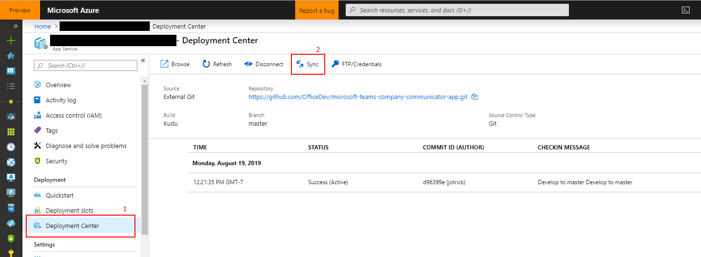

# General template issues

## Generic possible issues
There are certain issues that can arise that are common to many of the app templates. Please check [here](https://github.com/OfficeDev/microsoft-teams-stickers-app/wiki/Troubleshooting) for reference to these.

# Problems deploying to Azure

## 1. Code deployment failure
```
{
    "id": "/subscriptions/<subscription-id>/resourceGroups/<resource-group>/providers/Microsoft.Resources/deployments/Microsoft.Template/operations/E46C6DE7BE4DE2F9",
    "operationId": "E46C6DE7BE4DE2F9",
    "properties": {
        "provisioningOperation": "Create",
        "provisioningState": "Failed",
        "timestamp": "2019-08-19T19:42:57.0367572Z",
        "duration": "PT22M52.4117137S",
        "trackingId": "8ca12d86-552a-402d-8b06-4fc8fb450bbb",
        "statusCode": "Conflict",
        "statusMessage": {
            "status": "Failed",
            "error": {
                "code": "ResourceDeploymentFailure",
                "message": "The resource operation completed with terminal provisioning state 'Failed'."
            }
        },
        "targetResource": {
            "id": "/subscriptions/<subscription-id>/resourceGroups/<resource-group>/providers/Microsoft.Web/sites/<resource-name>/sourcecontrols/web",
            "resourceType": "Microsoft.Web/sites/sourcecontrols",
            "resourceName": "<resource-name>/web"
        }
    }
}
```
The resource type `Microsoft.Web/sites/sourcecontrols` failed to deploy. The transitive dependency set of the front-end web app pulls in over 1,000 NPM packages, and sometimes there is an error fetching all of the packages.

#### Fix

1. Go to the "Deployment center" section of the app service that failed to deploy.
2. Click on "Sync" to restart the deployment.

We are currently looking into how to make this process more resilient to intermittent failures.


## 2. Error when attempting to reuse a Microsoft Azure AD application ID for the bot registration
```
Bot is not valid. Errors: MsaAppId is already in use.
```

* Creating the resource of type Microsoft.BotService/botServices failed with status "BadRequest"

This happens when the Microsoft Azure application ID entered during the setup of the deployment has already been used and registered for a bot.

#### Fix
Either register a new Microsoft Azure AD application or delete the bot registration that is currently using the attempted Microsoft Azure application ID.

# Didn't find your problem here?
Please report the issue [here](https://github.com/OfficeDev/microsoft-teams-company-communicator-app/issues/new)
